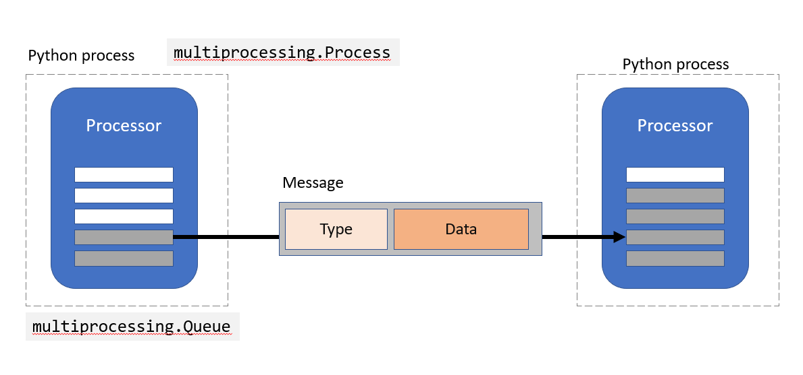

# System architecture

## Processor
At the core of pyneurode is the `Processor` class. A `Processor` is a `multiprocessing.Process` that runs in its own Python process and have a item queue (based on `multiprocessing.Queue`) for input data. A `Processor` work on the items on its input queue and generate results to be put on the output queue, which in turn are the corresponding input queues for downstream processors.

## Message
`Processor` communicate to each other via `Message`. A `Message` is a Python `dataclass` that has a 3 fields: `type`, `data` and optionally `timestamp`. The `type` is a string that indicate what data is stored in a `Message`. It can be any name, as long as downstream processor recognize it. `data` can be any anything supported by Python's `multiprocessing.Queue`. 

## GUIProcessor and Visualizer
The `GUIProcessor` is responsible for creating the graphical interface in pyNeurode. It relies on various `Visualizer` objects to show different visualization for various message type. We use DearPyGUI as our GUI toolkit as it is GPU accelerated and work across all three major platforms (Windows, MacOS and Linux).

