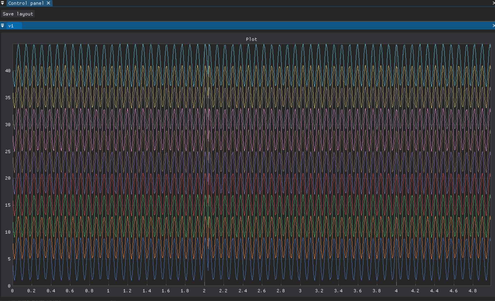

# Installation instructions

To use pyneurode, you will need both the Open Ephys GUI plugins and the pyneurode library  

1. Install the online whitening plugin from [link](https://github.com/MattNolanLab/OE_whitening).  
From our testing, online whitening is important for sorting accuracy

2. Install the OESpikeUtilities plugins from [link](https://github.com/MattNolanLab/OESpikeUtilities)  
The OESpikeUtilities plugin allows one to set a threshold for all channels, and also provides a modify LFP viewer to show the detected spikes

3. Install the ZMQ plugin from [link](https://github.com/teristam/ZMQPlugins)  
This is a fork of the original ZMQ plugins but with various bug fixes.

4. Clone the pyneurode library from git hub.  
`git clone https://github.com/teristam/pyneurode`

5. Go to the cloned project folder, install it with pip. All the package pre-requisite should also be installed automatically.  
`pip install .`  
(Note that some pyneurode code is written in Cython for optimized performance, so to install the package properly, your computer should have some kind of C++ compiler already installed.)  

6. Test the installation by running  
`python -m pyneurode.sorter_node_simpler`.  
If everything is installed correctly, a sample program will run

