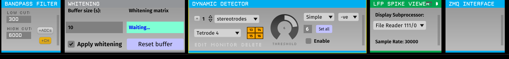
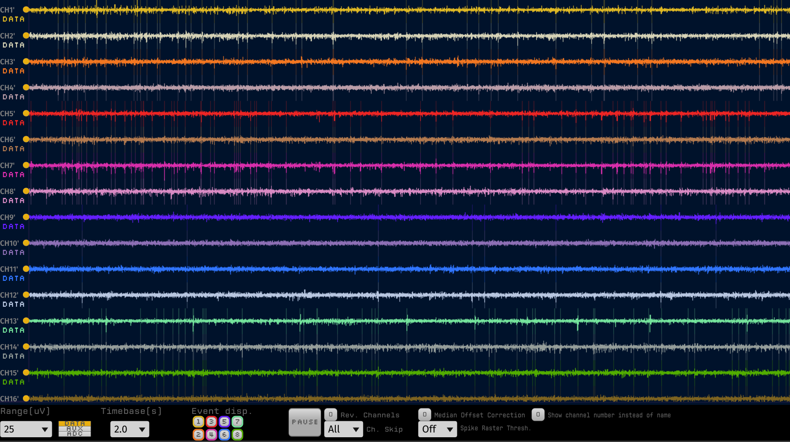

# Usage

Online spike sorting with pyneurode require the installation of some plugins in Open Ephys and also the pyneurode Python package.



## Open Ephys plugins 

1. Online whitening plugins  
After installation of the [online whitening](https://github.com/MattNolanLab/OE_whitening) plugin, add it behind the bandpass filter in the signal chain in Open Ephys. The "buffer size" parameter specifies how long a signal section you want to use to estimate the whitening matrix. You many want to use a relatively clean (e.g. without strong movement artifact) segment of the signal to estimate the whitening matrix. You can re-estimate the whitening matrix by pressing the "Reset buffer" button

2. Dynamic Spike detector  
The dyanmic spike detector plugin is part of the [OESpikeUtilities](https://github.com/MattNolanLab/OESpikeUtilities) plugin packages. It was modified from the orignal dynamic threshold plugin with bug fix and the ability to set the threshold to all channels at once.  This is especially useful if you have a lot of channel to detect. The spike detector should be placed behind the whitening plugin in the signal chain. Since whitening will change the amplitude of the signal, to avoid overloading the Open Ephys GUI with spurious spikes before the whitening matrix is estimated, the spike detecton is disabled by default. You need to manually enable the spike detection after the whitening matrix is ready.

3. LFP spike viewer  
OESpikeUtilities also comes with a LFP Spike Viewer. It will indicate the detected spikes by a thin vertical lines behind the signals. Besides that the LFP spike viewer function is almost identical with the bulid-in LFP Viewer.


4. ZMQ interface  
Spikes detected in the Open Ephys GUI are sent via ZeroMQ to the pyneurode platform. Therefore you also need to add the modified [ZMQ interface plugin](https://github.com/teristam/ZMQPlugins) to the end of the signal chain in Open Ephys. The modified plugin includes various bug fix to make sure the timestamp of the detected spikes are correct and the waveforms are properly sent through ZeroMQ.

## pyNeurode

After you have setup the plugins properly in Open Ephys, it is time to sort those spikes in pyneurode. 

First we import the modules we want to use. Most of the core modules are in the `pyneurode.processor_node` package.  

```
from pyneurode.processor_node.GUIProcessor import GUIProcessor
from pyneurode.processor_node.Processor import *
from pyneurode.processor_node.ProcessorContext import ProcessorContext
from pyneurode.processor_node.SpikeSortProcessor import SpikeSortProcessor
from pyneurode.processor_node.SyncDataProcessor import SyncDataProcessor
from pyneurode.processor_node.AnalogVisualizer import *
from pyneurode.processor_node.SpikeClusterVisualizer import SpikeClusterVisualizer
from pyneurode.processor_node.LatencyVisualizer import LatencyVisualizer
from pyneurode.processor_node.ZmqSource import ZmqSource
```

Then we need to create a `ProcessorContext`. The `ProcessorContext` is responsible for managing all the spawned processor nodes. It takes care of the proper start and shutdown of any child processes created by pyNeurode. Note that we need to exeucte the code inside a `if __name__ =='__main__'` block to ensure `multiprocessing` from the Python standard library can work properly under Windows.

```python
if  __name__ == '__main__':

    # Create a context object that manages some global states
    with ProcessorContext() as ctx:

    
```

After we have the context, then we can instantiate the processors

```python 
         # Initialize the processors we need
        zmqSource = ZmqSource(adc_channel=20)
        spikeSortProcessor = SpikeSortProcessor(interval=0.001, 
            min_num_spikes=2000)
        syncDataProcessor = SyncDataProcessor(interval=0.02)
        gui = GUIProcessor()

```

`ZmqSource` creates a processor for accepting the detected spikes sent over by Open Ephys. Analog behaviour signal capatured by the ADC on the Open Ephys Acquisition Board is also sent over. You can specify the analog channel by the `adc_channel` parameter.

The `SpikeSortProcessor` is the one that carries out the bulk of the work in online spike sorting. To be more efficient, the spike sorting is run at a fixed time interval (in seconds) indicated by the `interval` parameter. The `min_num_spikes` parameters specify how many spikes are used to estimate the initial spike sorting templates.

The `SyncDataProcessor` combine the time-binned firing rate output from `SpikesortProcessor` and the analog behavioural variable to form a synchronized neural firing rate with the behavioural data. This matrix can then be used for decoding or close-loop modulation.

The `GUIProcessor` is a special processor that handles the graphic user interface of pyNeurode.

After creating the processor nodes, we need to connect them together:

```python
        # Connect the processors to each others. The filters 
        # specify what type of messages are sent through that connection
        zmqSource.connect(spikeSortProcessor, filters='spike')
        spikeSortProcessor.connect(syncDataProcessor)
        zmqSource.connect(syncDataProcessor, 'adc_data')

```
Each processor has a `connect` function that accepts another processor. The connect function has a `filters` parameters, which accept a string or a list of string of message type that are allowed to pass through that connection. Specifying only the message type you need in the connection can reduce unnecessary inter-process communication and improve performance.

Next we also need to connect our processor nodes to the `GUIProcessor` so that it receive the data needed for visualizations.

```python
        Connect to the GUI processors so that messages can
        # be visualized
        zmqSource.connect(gui, 'adc_data')
        syncDataProcessor.connect(gui)
        spikeSortProcessor.connect(gui, ['df_sort','metrics'])

```

Visualization of specific message type is handled by the `Visualizer` class. The Visulizer class builds and update the GUI using [DearPyGUI](https://github.com/hoffstadt/DearPyGui)


```python
        # Initialize the set of visualizers
        analog_vis = AnalogVisualizer('Synchronized signals',
                scale=20, buffer_length=1000)
        pos_vis = AnalogVisualizer('pos', buffer_length=1000)
        cluster_vis = SpikeClusterVisualizer('cluster_vis')
        latency_vis = LatencyVisualizer('latency')

```

The visualizers then need to be registered with the `GUIProcessor` and tell it what kind of message they need:

```python
        # Register the visualizers to the GUI processor
        gui.register_visualizer(analog_vis,filters=['synced_data'])
        gui.register_visualizer(pos_vis, filters=['adc_data'])
        gui.register_visualizer(cluster_vis, filters=['df_sort'])
        gui.register_visualizer(latency_vis, filters=['metrics'])
```

Finally, we need to register all the processor with the context and then ask the context to start all the processors in parallel

```python
        # Register all the processors to the context
        ctx.register_processors(zmqSource, spikeSortProcessor, 
            syncDataProcessor,gui)
        
        # Start all processors
        ctx.start()

```